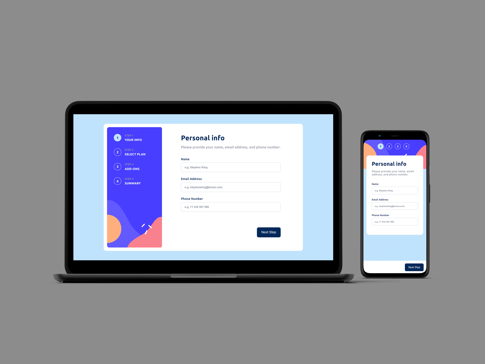

# **Multi-Step Form Application**

## **Table of content:**

-   [Description](#description)
-   [Key Features](#key-features)
-   [Project Structure](#project-structure)
-   [Conclusion](#conclusion)
-   [Technologies Used](#technologies-used)

**Live demo** [click here](https://multiple-step-form-app.netlify.app)

### **Description:**

This is a **Multi-Step Form Application** built using **React.js**, **React Hook Form**, **Context API**, and **CSS Modules**. The app provides an intuitive and dynamic user interface for collecting user inputs over multiple steps. Each step focuses on a specific aspect of the form process, ensuring a smooth and guided user experience.

---

### **Key Features:**

1. **Step-by-Step Navigation:**

    - Four steps:
        1. **User Information:** Collects user details like name, email, etc.
        2. **Select Plan:** Users choose a subscription plan (monthly or yearly).
        3. **Add Features:** Users can select additional features for their plan, each with individual pricing.
        4. **Summary:** Displays the total price and a detailed breakdown of the selected plan and features.
    - Navigation controls ensure users complete each step before proceeding, with the option to go back and make changes.

2. **Dynamic Price Calculation:**

    - The total price is updated in real-time based on the selected plan duration and additional features.

3. **Form Validation:**

    - Leveraging **React Hook Form** for efficient form validation and error handling.

4. **State Management:**

    - **Context API** is used to manage and share form data across components.

5. **Responsive Design:**

    - Adapts seamlessly to different screen sizes with visuals optimized for both desktop and mobile.

6. **Thematic Styling:**
    - **CSS Modules** are used for modular and scoped styling, ensuring a clean and maintainable codebase.

---

### **Technologies Used:**

-   **React.js:** Core library for building the UI.
-   **React Hook Form:** Simplifies form handling and validation.
-   **Context API:** Manages state across the multi-step flow.
-   **CSS Modules:** Provides component-scoped styling for a polished design.

---

### **Project Structure:**

-   index.html
-   public
-   src
    -   App.jsx
    -   assets
    -   components
        -   AddFeature.jsx
        -   AddFeature.module.css
        -   AddOns.jsx
        -   Button.jsx
        -   Button.module.css
        -   Confirmation.jsx
        -   Confirmation.module.css
        -   ContentHeader.jsx
        -   ContentHeader.module.css
        -   Feature.jsx
        -   Form.jsx
        -   Form.module.css
        -   Info.jsx
        -   Info.module.css
        -   Main.jsx
        -   Main.module.css
        -   Navigation copy.jsx
        -   Navigation.jsx
        -   Navigation.module.css
        -   Plan.jsx
        -   Plan.module.css
        -   Plans.jsx
        -   Plans.module.css
        -   Sidebar.jsx
        -   Sidebar.module.css
        -   Spinner.jsx
        -   Spinner.module.css
        -   Step.jsx
        -   Step.module.css
        -   Summary.jsx
        -   Summary.module.css
        -   Switch.jsx
        -   Switch.module.css
    -   contexts
        -   ConfirmationContext.jsx
        -   InfoContext.jsx
    -   index.css
    -   main.jsx
    -   purchaseData.js

---

### **Conclusion:**

The **Multi-Step Form Application** is a user-friendly and efficient solution for gathering detailed user input over multiple stages. Its clean design, interactive functionality, and dynamic pricing features make it suitable for applications like subscription services, booking platforms, and e-commerce checkouts.
